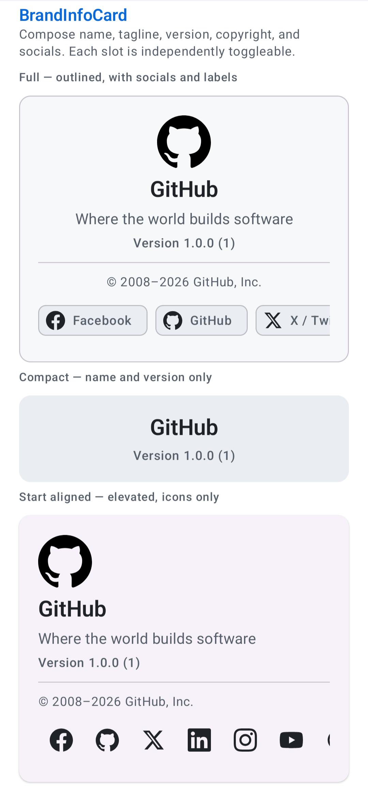
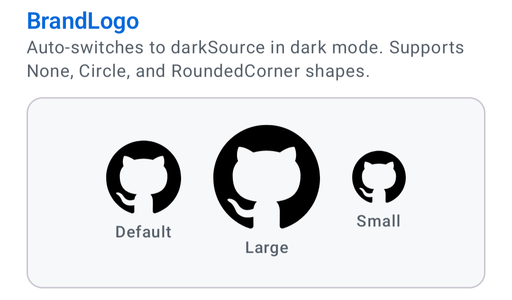
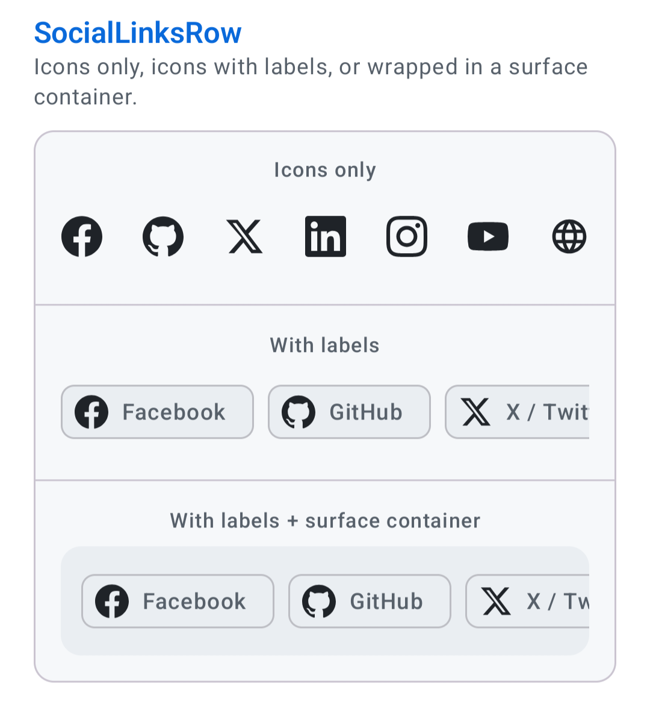
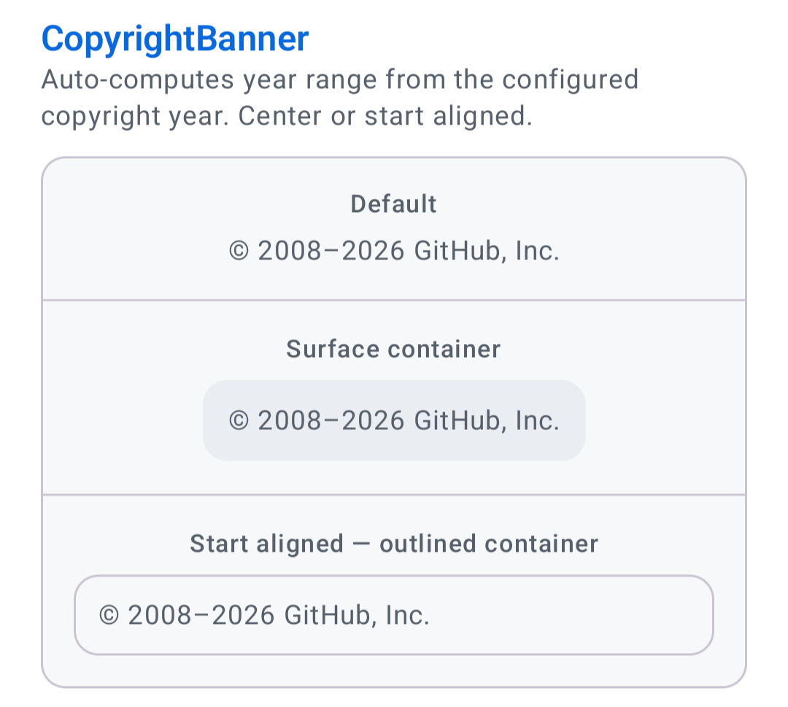
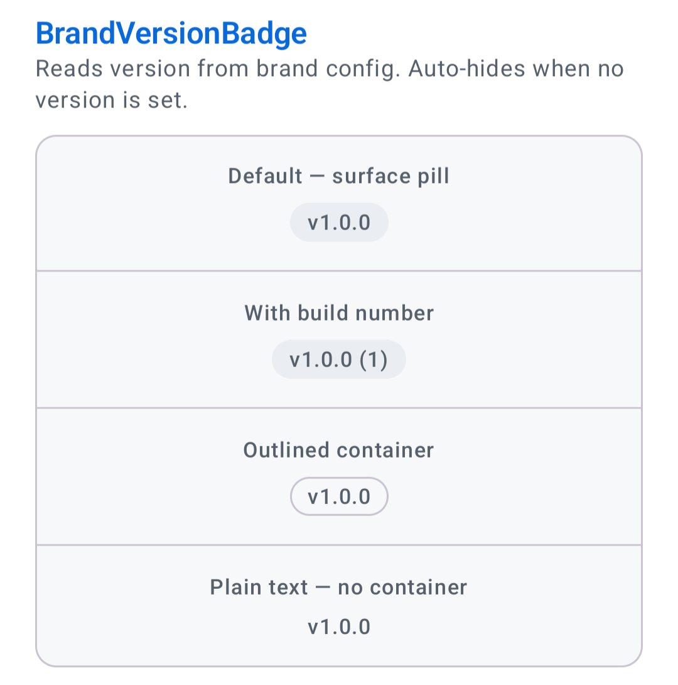
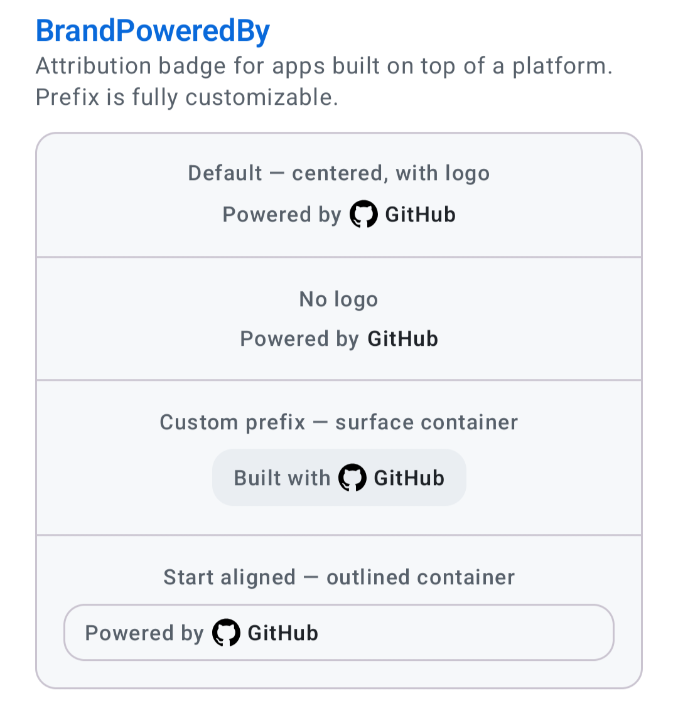
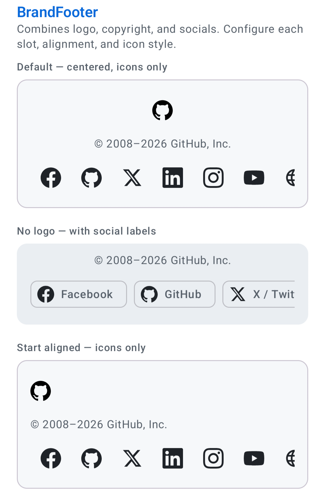

# compose-brand-kit

[](https://github.com/iabanoubsamir/compose-brand-kit/actions/workflows/ci.yml)
[](https://central.sonatype.com/artifact/io.github.iabanoubsamir/brandkit)
[](LICENSE)
[](https://android-arsenal.com/api?level=24)
[](https://kotlinlang.org)
[](https://developer.android.com/compose)

A Jetpack Compose library that lets you define your brand identity once and drop ready-made branded composables — logo, footer, copyright, social links, version badge, and more — into any app.

---

## Screenshots

| BrandInfoCard | BrandLogo |
| :---: | :---: |
|  |  |

| SocialLinksRow | CopyrightBanner |
| :---: | :---: |
|  |  |

| BrandVersionBadge | BrandPoweredBy |
| :---: | :---: |
|  |  |

| BrandFooter |
| :---: |
|  |

---

## Requirements

- Android API 24+
- Jetpack Compose (BOM 2024.09.00+)
- Material 3

---

## Features

- **Type-safe DSL** — configure your brand in one place with `brandKit { }`
- **Dark mode** — automatic light/dark color palette and logo switching
- **Locale support** — all user-visible text fields accept string resource IDs
- **Composable slots** — every composable is independently configurable; toggle any slot on/off
- **Container styles** — wrap any composable in None, Surface, Outlined, or Elevated containers
- **Host-app friendly** — use `BrandTheme` for full theming, or inject brand context only without touching your existing `MaterialTheme`

---

## Installation

```kotlin
// app/build.gradle.kts
dependencies {
    implementation("io.github.iabanoubsamir:brandkit:1.0.0")
}
```

Maven Central is included in the default repositories — no extra repository setup needed.

---

## Quick Start

### 1. Define your brand

Create a top-level `BrandConfig` using the `brandKit { }` DSL:

```kotlin
val MyBrand: BrandConfig = brandKit {
    info {
        name = "My App"
        tagline = "Short catchy tagline"
        website = "https://example.com"
        copyrightYear = 2024
        copyrightHolder = "My Company, Inc."
        versionName = "1.0.0"
        versionCode = 1
    }
    colors {
        primary = Color(0xFF0969DA)
        secondary = Color(0xFF238636)
    }
    darkColors {                        // optional — falls back to colors if omitted
        primary = Color(0xFF58A6FF)
        secondary = Color(0xFF3FB950)
    }
    typography {                        // optional — defaults to system font
        fontFamily = FontFamily.SansSerif
        headlineFontWeight = FontWeight.Bold
    }
    logo {
        fromResource(R.drawable.ic_logo_light)
        darkFromResource(R.drawable.ic_logo_dark)   // optional dark variant
        shape = BrandLogoShape.RoundedCorner(cornerPercent = 22)
        contentDescription = "My App logo"
    }
    socials {
        link(SocialPlatform.GITHUB,    "https://github.com/myapp")
        link(SocialPlatform.TWITTER,   "https://twitter.com/myapp", label = "X / Twitter")
        link(SocialPlatform.LINKEDIN,  "https://linkedin.com/company/myapp")
        link(SocialPlatform.INSTAGRAM, "https://instagram.com/myapp")
    }
}
```

### 2. Wrap your app with BrandTheme

```kotlin
class MainActivity : ComponentActivity() {
    override fun onCreate(savedInstanceState: Bundle?) {
        super.onCreate(savedInstanceState)
        setContent {
            BrandTheme(MyBrand) {
                // All brand composables work inside here
            }
        }
    }
}
```

### 3. Use the composables

```kotlin
// All-in-one identity card
BrandInfoCard(modifier = Modifier.fillMaxWidth(), showSocials = true)

// Footer — logo + copyright + social links
BrandFooter(modifier = Modifier.fillMaxWidth(), containerStyle = BrandContainerStyle.Outlined)

// Copyright line — auto year range "© 2024–2026 My Company, Inc."
CopyrightBanner()

// Social links row
SocialLinksRow(showLabels = true)

// Version badge — auto-hides when no version is set
BrandVersionBadge()

// "Powered by" attribution
BrandPoweredBy(prefix = "Built with")

// Logo — auto-switches to dark variant
BrandLogo(modifier = Modifier.size(48.dp))
```

---

## Composables

| Composable | Description | Key parameters |
| --- | --- | --- |
| `BrandTheme` | Root wrapper — provides brand context and optional MaterialTheme override | `applyColorScheme`, `applyTypography`, `darkTheme` |
| `BrandInfoCard` | All-in-one identity card with independently togglable slots | `showLogo`, `showTagline`, `showVersion`, `showCopyright`, `showSocials`, `centered` |
| `BrandLogo` | Brand logo image — auto-switches light/dark source | `modifier`, `contentDescription` |
| `BrandFooter` | Logo + copyright + social links in a single composable | `showLogo`, `showCopyright`, `showSocials`, `centered` |
| `CopyrightBanner` | Copyright line with auto-computed year range | `centered`, `style`, `containerStyle` |
| `SocialLinksRow` | Row of social platform icon buttons | `showLabels`, `containerStyle` |
| `BrandVersionBadge` | Version pill — auto-hides when no version is configured | `showBuildNumber`, `style`, `containerStyle` |
| `BrandPoweredBy` | Attribution badge — `"[prefix] [logo] Brand Name"` | `prefix`, `showLogo`, `logoSize`, `centered` |
| `BrandDivider` | Brand-tinted `HorizontalDivider` | `modifier`, `thickness` |

All composables accept `modifier: Modifier` and `containerStyle: BrandContainerStyle`.

---

## Container Styles

Every composable accepts a `containerStyle` parameter that wraps its content in a Material 3 surface:

| Style | Appearance |
| --- | --- |
| `BrandContainerStyle.None` | No background (default) |
| `BrandContainerStyle.Surface` | Filled surface background |
| `BrandContainerStyle.Outlined` | Outlined border, no fill |
| `BrandContainerStyle.Elevated` | Elevated surface with shadow |

```kotlin
CopyrightBanner(containerStyle = BrandContainerStyle.Outlined)
BrandVersionBadge(containerStyle = BrandContainerStyle.Surface)
BrandFooter(containerStyle = BrandContainerStyle.Elevated)
```

---

## Logo Shapes

| Shape | Description |
| --- | --- |
| `BrandLogoShape.None` | No clipping (default) |
| `BrandLogoShape.Circle` | Circular clip |
| `BrandLogoShape.RoundedCorner(cornerPercent)` | Rounded rectangle — `cornerPercent` controls the radius |

---

## Social Platforms

Built-in icons are provided for:
`TWITTER`, `LINKEDIN`, `GITHUB`, `INSTAGRAM`, `FACEBOOK`, `YOUTUBE`, `WEBSITE`, `OTHER`

For any platform not in the list, use `SocialPlatform.OTHER` with a custom icon:

```kotlin
socials {
    link(
        platform = SocialPlatform.OTHER,
        url = "https://discord.gg/myapp",
        label = "Discord",
        icon = discordImageVector,
    )
}
```

---

## Font Customization

Use the `BrandFont` helpers inside the `typography { }` block:

```kotlin
typography {
    // From a bundled asset font
    fontFamily = BrandFont.asset(
        Font(R.font.inter_regular),
        Font(R.font.inter_bold, weight = FontWeight.Bold),
    )

    // Or a system font family
    fontFamily = BrandFont.system(FontFamily.Monospace)

    headlineFontWeight = FontWeight.Bold
    titleFontWeight = FontWeight.SemiBold
}
```

---

## Locale Support

All user-visible text fields accept string resource IDs for full locale support:

```kotlin
info {
    nameRes(R.string.brand_name)
    taglineRes(R.string.brand_tagline)
    copyrightHolderRes(R.string.brand_copyright_holder)
}

logo {
    contentDescriptionRes(R.string.brand_logo_description)
}
```

---

## Using with an Existing MaterialTheme

If your app already configures its own `MaterialTheme`, set `applyColorScheme = false` and/or `applyTypography = false` so the library doesn't override your theme:

```kotlin
MyAppTheme {
    BrandTheme(MyBrand, applyColorScheme = false, applyTypography = false) {
        BrandFooter()
    }
}
```

---

## Contributing

See [CONTRIBUTING.md](CONTRIBUTING.md).

---

## License

[MIT](LICENSE) © 2026 Abanoub Samir
